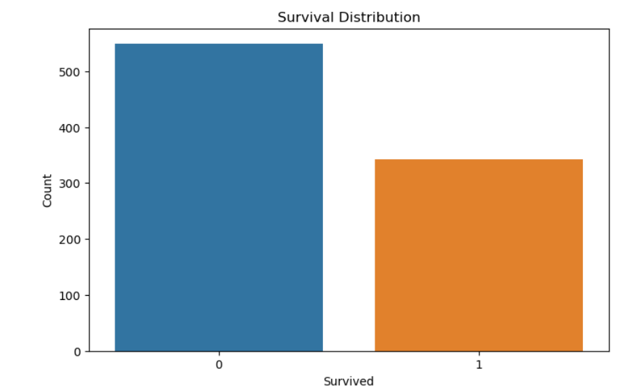
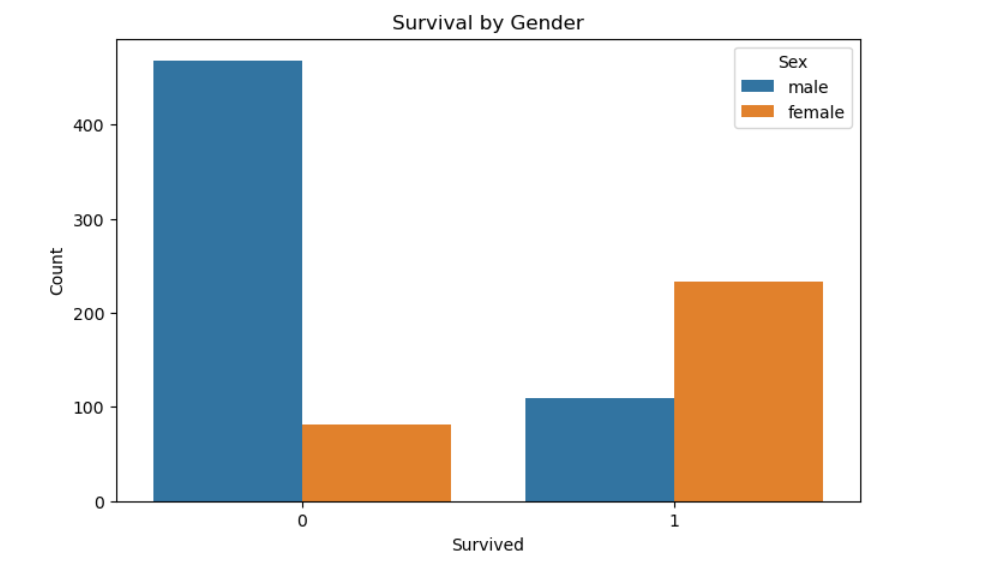
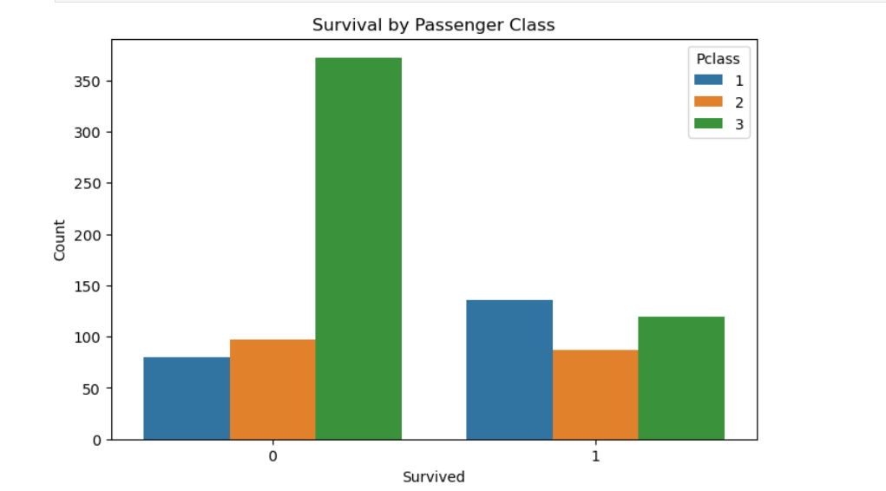
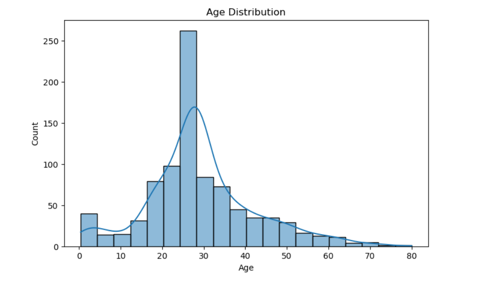
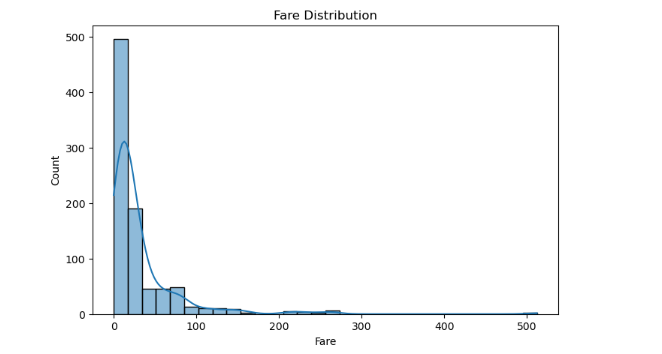

# Titanic Survival Data Analysis

## Project Overview

This project performs **Exploratory Data Analysis (EDA)** on the famous **Titanic dataset** to understand the factors that influenced passenger survival during the Titanic disaster.

Using Python and data visualization techniques, the analysis explores relationships between survival and variables such as **gender, passenger class, age, and fare**.

The goal of this project is to demonstrate **data cleaning, preprocessing, and exploratory analysis techniques** commonly used by Data Analysts.

---

## Objectives

The main objectives of this project are:

• Perform data cleaning and preprocessing  
• Handle missing values in the dataset  
• Explore survival patterns among passengers  
• Analyze relationships between different variables  
• Visualize important trends using graphs  

---

## Dataset

The dataset contains passenger information from the Titanic ship including:

- Passenger ID
- Survival status
- Passenger class
- Name
- Gender
- Age
- Number of siblings/spouses aboard
- Number of parents/children aboard
- Ticket number
- Fare
- Cabin number
- Port of embarkation

Dataset files used:

```
titanic_train_data.csv
titanic_test_data.csv
```

---

## Technologies Used

This project was implemented using:

- Python
- Pandas
- NumPy
- Matplotlib
- Seaborn
- Jupyter Notebook

---

## Data Cleaning

Several preprocessing steps were performed:

### Handling Missing Values

- Missing **Age values** were replaced using the **median age**.
- Missing **Embarked values** were filled using the **mode**.

```python
datat['Age'].fillna(datat['Age'].median(), inplace=True)

mode_embarked = datat['Embarked'].mode()[0]
datat['Embarked'].fillna(mode_embarked, inplace=True)
```

---

### Removing Irrelevant Columns

The **Cabin column** contained a large number of missing values, so it was removed.

```python
datat.drop('Cabin', axis=1, inplace=True)
```

---

## Exploratory Data Analysis

The project explores various aspects of the dataset through visualizations.

---

### Survival Distribution

This chart shows how many passengers survived vs did not survive.



---

### Survival by Gender

Analysis shows that **female passengers had a higher survival rate than male passengers**.



---

### Survival by Passenger Class

Passengers in **first class had a higher survival probability** compared to second and third class passengers.



---

### Age Distribution

This visualization shows the distribution of passenger ages.



---

### Fare Distribution

Shows how ticket fares were distributed among passengers.



---

### Correlation Heatmap

Displays relationships between numerical variables in the dataset.


---

## Key Insights

• Female passengers had significantly higher survival rates.  
• First-class passengers had better survival chances than lower classes.  
• Younger passengers and children had slightly better survival rates.  
• Ticket fare showed correlation with passenger class and survival.

---

## Project Structure

```
titanic-survival-data-analysis
│
├── data
│   ├── titanic_train_data.csv
│   └── titanic_test_data.csv
│
├── notebooks
│   └── titanic_analysis.ipynb
│
├── images
│   ├── plots
│
├── requirements.txt
└── README.md
```

---

## Future Improvements

Possible improvements for this project include:

• Building a **machine learning model to predict survival**  
• Creating **interactive dashboards using Power BI or Tableau**  
• Performing **feature engineering for better predictions**

---

## Author

**Asin Fraisiya**

BCA – Data Analytics  
Aspiring Data Analyst | Python | Data Visualization | Power BI  

GitHub  
https://github.com/asinantony
